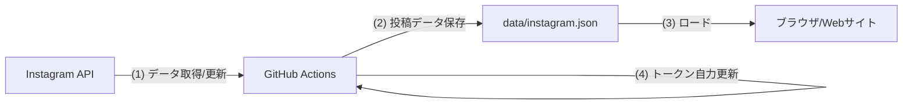

# 概要設計書：自前Instagramウィジェット（sukusuku-instagram-widget）

## 1. システム構成案
本システムは、セキュリティとパフォーマンスを両立させるため、**「ビルド時/定期実行時のデータ生成（Jamstack形）」** を採用します。

### 全体構造図


## 2. コンポーネント設計

### 2.1 バックエンド処理 (GitHub Actions)
- **頻度**: 1日1回（19:00 JST / 10:00 UTC）、30日1回（トークン更新）。
- **言語**: Node.js または Python 
- **主要機能**:
  1. `INSTAGRAM_TOKEN`（GitHub Secretsに格納）を使用し、`https://graph.instagram.com/me/media` を叩く。
  2. 最新の `media_url`, `permalink`, `caption`, `timestamp` を取得。
  3. 取得したデータを `data/instagram.json` として整形し、リポジトリにコミット。
  4. トークンの残存期間を確認し、必要に応じて `refresh_access_token` エンドポイントを叩いて更新する。

### 2.2 データ定義 (data/instagram.json)
```json
{
  "last_updated": "2026-03-17T12:00:00Z",
  "posts": [
    {
      "id": "12345",
      "media_url": "https://...",
      "permalink": "https://www.instagram.com/p/...",
      "caption": "今日の給食は...",
      "media_type": "IMAGE"
    },
    ...
  ]
}
```

### 2.3 フロントエンド処理 (HTML/JS)
- **場所**: `index.html` および `js/instagram-widget.js`（新設）
- **処理フロー**:
  1. `fetch('data/instagram.json')` でデータを読み込む。
  2. JavaScriptで `card` 構造（Elfsight風）のHTML要素を2×2で生成。
  3. `index.html` の所定の `div` に挿入。
- **デザイン詳細**:
  - `img` タグの `aspect-ratio: 1/1` と `object-fit: cover` を使用し、正方形ポラロイド風に統一。
  - ホバー時に半透明のオーバーレイとInstagramロゴを表示。

## 3. セキュリティ設計
- **トークン隠蔽**: APIトークンはGitHubリポジトリのSecretsに保存し、公開される `data/instagram.json` には含めない。
- **公開情報**: `data/instagram.json` にはメディアのURLとパーマリンクのみを含める。

## 4. 導入ステップ
1. Meta for Developers でアプリ作成、初期「短期トークン」取得。
2. 短期トークンを「長期トークン」に手動変換。
3. GitHubリポジトリに `INSTAGRAM_TOKEN` を設定。
4. GitHub Actions用スクリプト（`.github/workflows/update-instagram.yml`）を作成。
5. フロントエンドのJS実装とCSS調整。

---
作成日: 2026-03-17
作成者: Antigravity
